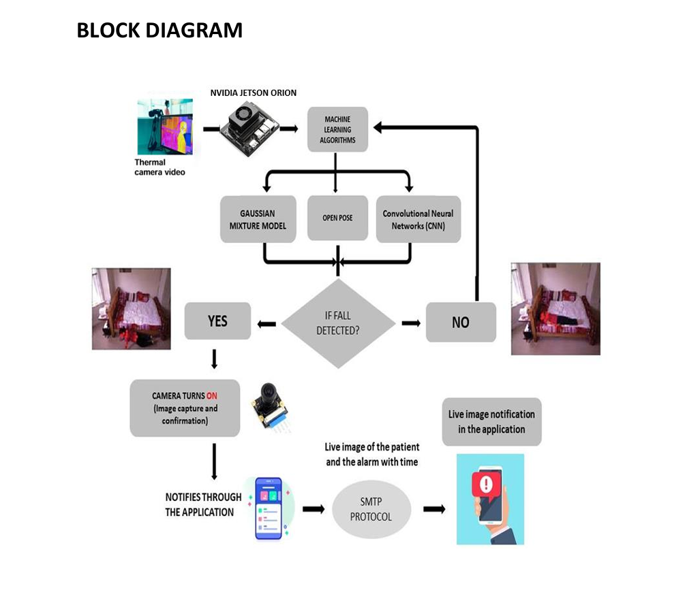
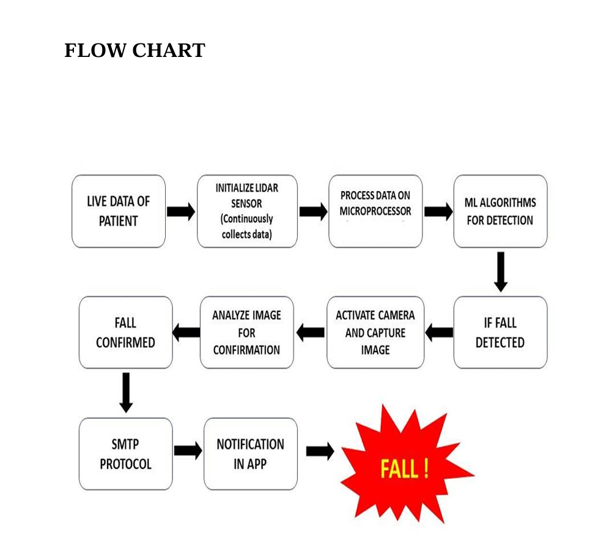
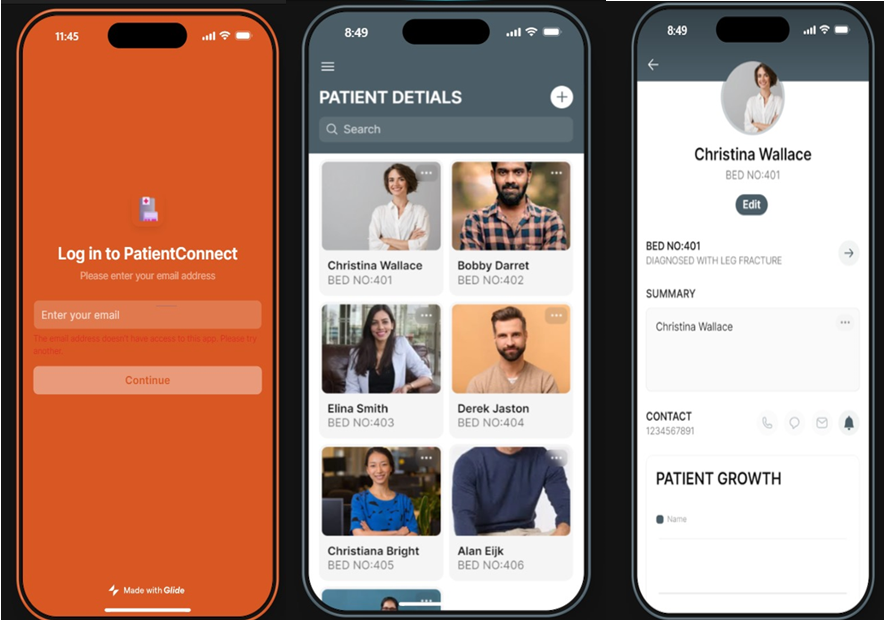
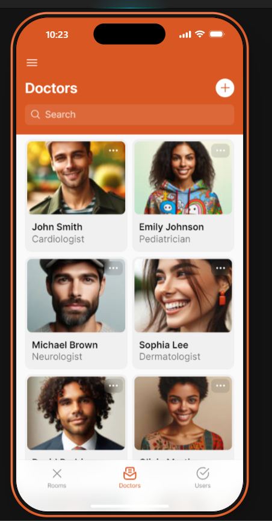
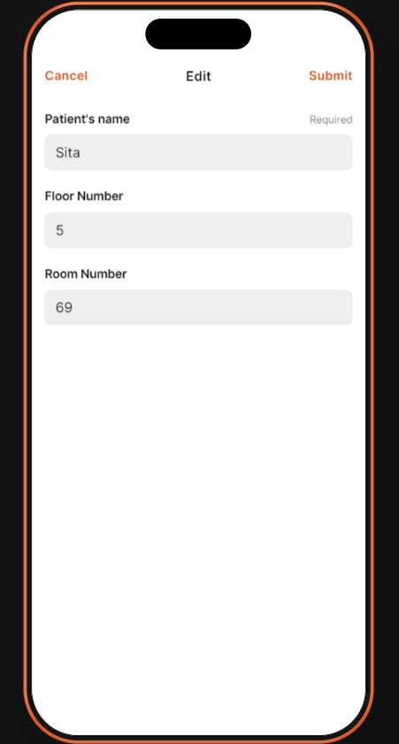
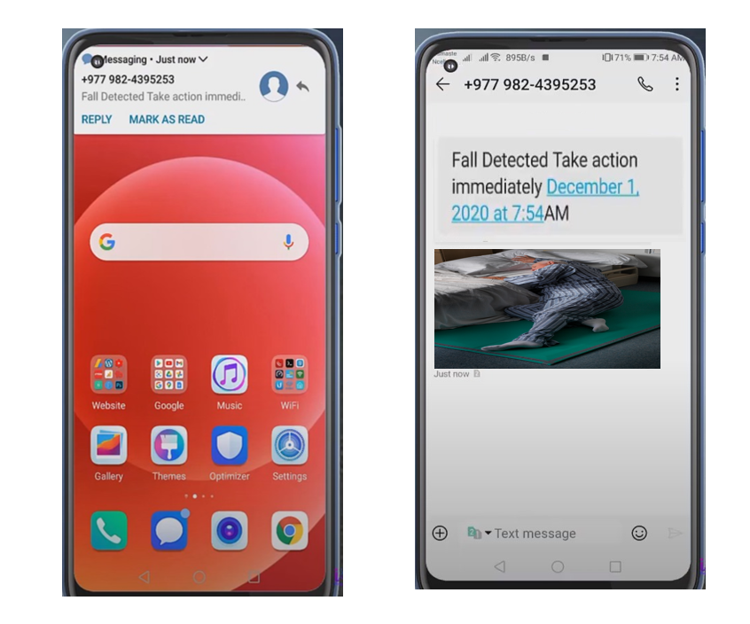
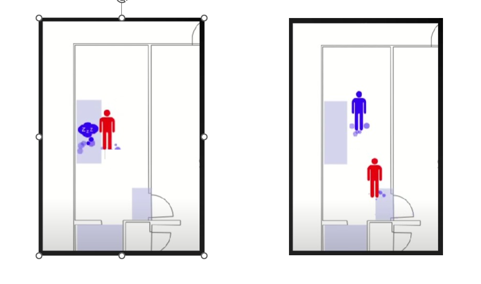

# Vigilant: Fall Detection with Embedded LiDAR Technology

[](software/implementation_notes.md)
[](docs/Patent_Application.pdf)
[](LICENSE)
[](https://developer.nvidia.com/embedded/jetson-nano)

An AI-powered healthcare monitoring system that detects human falls using LiDAR and computer vision while preserving user privacy through selective camera activation.

**This repository documents the research, system architecture, hardware design, and prototype developed as part of an academic invention project.**

---

## Overview

Traditional fall detection systems depend on wearable devices or continuous camera surveillance, both of which introduce challenges related to comfort, compliance, and privacy.

This project presents a fall detection approach that combines:

- LiDAR-based motion sensing
- AI-powered pose estimation
- Computer vision
- Edge computing
- Real-time caregiver notifications

The system is designed to continuously monitor movement using LiDAR. A camera activates only after a potential fall has been detected, reducing unnecessary surveillance while still enabling visual confirmation.

## Problem Statement

Current fall detection systems often suffer from:

- Wearable device dependency and non-compliance
- Privacy concerns from continuous video surveillance
- False alarms from simple threshold-based detection
- User discomfort with visible devices

## Proposed Solution

A privacy-preserving fall detection system that:

1. Continuously monitors an area using LiDAR instead of an always-on camera.
2. Processes sensor data locally on an edge device (NVIDIA Jetson Nano).
3. Applies AI-based pose/motion analysis to identify a likely fall.
4. Activates a camera only after a potential fall is flagged, for visual confirmation.
5. Sends a real-time notification to a caregiver when a fall is confirmed.

## Key Features

- Wearable-free monitoring
- LiDAR-based fall detection
- Privacy-preserving, selective camera activation
- AI-powered pose estimation
- Real-time notifications
- Edge AI processing on Jetson Nano
- Designed with healthcare/hospital deployment in mind

## System Architecture

```
Patient
    │
    ▼
RPLIDAR A1
    │
    ▼
Jetson Nano
    │
    ▼
AI Fall Detection
(OpenPose + YOLO)
    │
    ▼
Fall Detected?
      │
 ┌────┴────┐
 │         │
 No       Yes
 │         │
 │    Activate Camera
 │         │
 │         ▼
 │   Capture Image
 │         ▼
 │  SMTP Notification
 │         ▼
 │   Mobile App Alert
 │
 ▼
Continue Monitoring
```

**Block diagram**



**Workflow**



## Hardware Used

- NVIDIA Jetson Nano — edge AI compute
- RPLIDAR A1 — 360° 2D LiDAR sensor
- USB camera — selective visual confirmation
- Supporting power and networking components

See [hardware/components_list.md](hardware/components_list.md) for the full list.

## Software Used

| Category | Technology |
|-----------|--------------|
| Language | Python |
| Computer Vision | OpenCV |
| Pose Detection | OpenPose |
| Object Detection | YOLO |
| Machine Learning | Gaussian Mixture Model, CNN |
| Sensor SDK | RPLIDAR SDK |
| Edge Platform | NVIDIA JetPack |
| OS | Ubuntu (via JetPack) |
| Notifications | SMTP |

See [software/software_used.md](software/software_used.md) for details, and [software/implementation_notes.md](software/implementation_notes.md) for the implementation approach.

## Workflow

1. LiDAR continuously scans the environment.
2. Jetson Nano receives point-cloud/depth information.
3. AI models analyze posture and motion.
4. A potential fall is flagged.
5. The camera activates.
6. An image is captured for confirmation.
7. An alert is generated.
8. A notification is sent to the caregiver.

## Companion App — PatientConnect

A companion mobile app prototype, **PatientConnect**, was built to let caretakers manage patients/rooms and receive fall alerts.

| | | |
|---|---|---|
|  |  |  |

See [images/README.md](images/README.md) for the full set of app screens.

## Privacy-Preserving Approach

Unlike conventional surveillance systems, this solution keeps the camera off by default and activates it only after a suspected fall is detected by the LiDAR-based pipeline. This is intended to significantly reduce continuous visual monitoring while preserving the ability to confirm a fall event.

## Results

This project reached the stage of a research prototype and proof-of-concept validation as part of the associated invention disclosure and patent application. Detailed methodology and findings are documented in the patent application and reference paper — see [docs/](docs/). Quantitative performance figures are not restated in this README to avoid presenting unverified numbers; refer to the source documents directly.

Below are demonstration captures from prototype testing: a simulated fall scenario, the resulting phone notification, and the alert message with the captured confirmation image.

| Test scenario | Notification | Alert with captured image |
|---|---|---|
|  |  |  |

## Applications

- Hospitals
- Elderly care
- Rehabilitation centers
- Smart homes
- Assisted living
- Industrial safety monitoring

## Future Scope

- Mobile application integration
- Cloud dashboard for multi-facility monitoring
- Multi-patient/multi-person detection
- Wearable device integration
- Edge inference optimization (e.g. TensorRT)
- Clinical validation and regulatory approval

## Authors

- Tharani R.
- Sreevarshan J.
- Sri Siva Kavya R.
- V. Haritha

## Patent Information

A patent application has been filed for this system as part of the academic invention disclosure process.

- Patent application: [docs/Patent_Application.pdf](docs/Patent_Application.pdf)
- Filing status: [docs/Patent_Status.png](docs/Patent_Status.png)

## Publications

- [docs/Published_Paper.pdf](docs/Published_Paper.pdf) — published paper associated with this project
- [docs/Reference_Paper.pdf](docs/Reference_Paper.pdf) — reference/related work

## Repository Structure

```
Vigilant-Fall-Detection-with-Embedded-LiDAR-Technology/
├── README.md
├── LICENSE
├── docs/            Patent application, patent status, and papers
├── images/          Diagrams, app screens, and demo results (see images/README.md)
├── hardware/        Bill of materials
├── software/        Technology stack and implementation notes
├── demo/            Demonstration video (as available)
└── code/            Code availability statement
```

## Project Status

Academic research prototype. See [software/implementation_notes.md](software/implementation_notes.md) for what is and isn't included in this repository.

## License

This project is licensed under the MIT License — see [LICENSE](LICENSE) for details.

## Disclaimer

This repository showcases the project architecture, research methodology, hardware design, and implementation approach developed as part of an academic research and invention disclosure project. It is not a production-ready software release; see [code/README.md](code/README.md) for the code availability statement.
